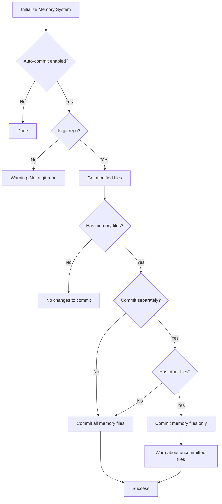

# Auto-Commit Feature for Memory System Updates

## Overview

This feature adds automatic git commit functionality for memory system updates in the `--simple` initialization mode. It allows users to enable automatic commits for Claude memory system changes while keeping full control over commit behavior.

## Features

### 1. Git Configuration in Simple Mode

During `--simple` initialization, users are now asked two questions:

1. **Enable auto-commit for memory system updates?**
   - Default: `No`
   - When enabled, memory system files will be automatically committed after initialization

2. **Commit memory updates separately from other file changes?**
   - Default: `Yes`
   - Only shown if auto-commit is enabled
   - Controls whether memory system updates should be in separate commits

### 2. Smart File Separation

The system intelligently separates files into two categories:

**Memory System Files:**
- All files under `claude/` directory (or custom base_dir)
- `CLAUDE.md` in project root
- Config files, prompts, memory notes, etc.

**Other Files:**
- Any modified files outside the memory system

### 3. Commit Strategies

#### Strategy A: Separate Commits (Default)
When `commit_memory_separately: true` and there are other modified files:

1. **First commit:** Memory system files only
   - Message: `chore: update memory system (config, prompts, memory)`
   - Includes detailed file list and timestamp

2. **Second commit:** User must commit other files manually
   - Warning displayed to user about uncommitted files

#### Strategy B: Memory Only
When only memory files are modified or `commit_memory_separately: false`:

1. **Single commit:** Memory system files
   - Same commit message format as Strategy A

### 4. Automatic Commit Message Generation

Commit messages are automatically generated with:

- **Type:** `chore:`
- **Scope:** Detected categories (config, prompts, memory, CLAUDE.md)
- **Description:** Brief summary of what was updated
- **Body:**
  - Date of change
  - Number of files updated
  - Auto-generated signature

**Example:**
```
chore: update memory system (config, prompts, CLAUDE.md)

Update Claude memory system configuration and files.

Date: 2025-01-12
Files updated: 5

Auto-generated commit by claude-memory-init.
```

## Configuration

### Type Definition

```typescript
export interface GitConfig {
  ai_git_operations: boolean;           // Original: allow AI to perform git ops
  ignore_patterns: string[];             // Files/dirs to ignore
  auto_commit_memory_updates?: boolean;  // NEW: Auto-commit memory updates
  commit_memory_separately?: boolean;    // NEW: Separate memory commits
}
```

### Default Values

**Simple Mode (with user prompts):**
```typescript
{
  ai_git_operations: <user-choice>,
  ignore_patterns: ['claude/temp/'],
  auto_commit_memory_updates: <user-choice>,
  commit_memory_separately: true  // default: true
}
```

**Quick/Interactive Modes:**
```typescript
{
  ai_git_operations: false,
  ignore_patterns: ['claude/temp/'],
  auto_commit_memory_updates: false,  // disabled by default
  commit_memory_separately: true
}
```

## Usage

### Basic Usage

```bash
# Run simple mode initialization
pnpm dlx github:dt-activenetwork/claude-memory-init init --simple

# You'll be prompted:
# ⚙️  Git Configuration
# ? Enable auto-commit for memory system updates? (y/N)
```

### Example: Enable Auto-Commit

```bash
$ pnpm dlx ... init --simple

⚙️  Git Configuration
? Enable auto-commit for memory system updates? Yes
? Commit memory updates separately from other file changes? Yes

✓ Configuration saved
✓ Memory system initialized

📝 Auto-committing changes...

📦 Committing 5 memory system file(s) separately...
✅ Memory system changes committed

📝 Files committed:
  - claude/config.yaml
  - claude/CLAUDE.md
  - claude/prompt/0.overview.md
  - claude/memory/system/tools/code-reference-format.md
  - CLAUDE.md

✅ Initialization complete!
```

### Example: With Other Modified Files

```bash
$ pnpm dlx ... init --simple
# ... (initialization with auto-commit enabled)

📝 Auto-committing changes...

📦 Committing 5 memory system file(s) separately...
✅ Memory system changes committed

📝 Files committed:
  - claude/config.yaml
  - claude/CLAUDE.md
  - CLAUDE.md

⚠️  Note: 2 other file(s) remain uncommitted:
  - src/index.ts
  - README.md
💡 Commit these files manually or they will be included in the next commit
```

## Implementation Details

### Key Files Modified

1. **src/types/config.ts**
   - Extended `GitConfig` interface with new fields

2. **src/prompts/simple-prompts.ts**
   - Added `promptGitConfigSimple()` function
   - Interactive prompts for git configuration

3. **src/utils/auto-commit.ts** (NEW)
   - `isGitRepository()` - Check if directory is a git repo
   - `getModifiedFiles()` - Get list of modified files
   - `separateMemoryFiles()` - Separate memory vs other files
   - `generateMemoryCommitMessage()` - Generate commit message
   - `createCommit()` - Execute git commit
   - `autoCommitMemoryUpdates()` - Main orchestration function

4. **src/cli.ts**
   - Updated `initSimple()` to call git config prompt
   - Integrated auto-commit after initialization
   - Updated git config defaults in `initQuick()` and `initInteractive()`

### Auto-Commit Flow



### Safety Features

1. **Git Repository Check**
   - Only attempts commit if directory is a git repository
   - Displays warning if not a git repo

2. **No Empty Commits**
   - Checks if there are actually modified files before committing

3. **Error Handling**
   - Graceful error handling for git operations
   - User-friendly error messages

4. **User Control**
   - Feature is opt-in (default: disabled)
   - Clear prompts explain what will happen
   - User can choose commit strategy

## Use Cases

### Use Case 1: Solo Developer
Enable auto-commit to automatically track memory system changes without manual commits.

### Use Case 2: Team Environment
Enable auto-commit with separate commits to keep memory system changes isolated and easy to review.

### Use Case 3: CI/CD Pipeline
Keep auto-commit disabled (default) to maintain full manual control over commits.

## Best Practices

1. **Enable auto-commit if:**
   - You want automatic tracking of memory system changes
   - You're working solo or in a small team
   - You trust the generated commit messages

2. **Keep separate commits enabled if:**
   - You want clean git history
   - You review memory system changes separately
   - You're working in a team

3. **Disable auto-commit if:**
   - You prefer manual control over all commits
   - You're in a CI/CD environment
   - You want custom commit messages

## Future Enhancements

Possible future improvements:

1. **Custom Commit Message Templates**
   - Allow users to customize commit message format

2. **Commit Message Editor**
   - Prompt user to edit commit message before committing

3. **Pre-commit Hooks Integration**
   - Run linters/formatters before committing

4. **Selective File Commits**
   - Allow user to select which files to commit

5. **Branch Strategy**
   - Optionally create a new branch for memory system changes

## Related Configuration

This feature interacts with the existing `ai_git_operations` setting:

- `ai_git_operations: false` (default) - AI cannot perform git operations
- `auto_commit_memory_updates: true` - Tool can perform automated commits

When `auto_commit_memory_updates` is enabled, it sets `ai_git_operations` to match, ensuring consistent behavior.

## Changelog

**Version 1.1.0** (2025-01-12)
- Added auto-commit feature for memory system updates
- Added git configuration prompts in simple mode
- Created smart file separation logic
- Implemented automatic commit message generation
